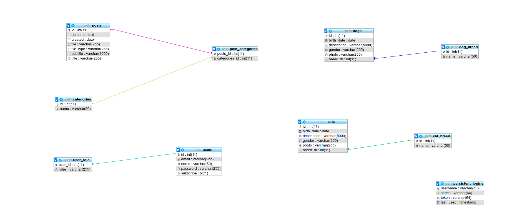

# Pet shelter
The project was created for a pet shelter.

## About project
Application for:
- adding information about a new animal (sections for cats and dogs)
- display detailed information about a particular animal
- adding and editing breeds for cats and dogs
- view useful information on the care, nutrition and training of animals in the "Posts" section
- adding new posts with the ability to download videos and photos
- view full post information with the ability to edit
- sending notifications by email about a new post to all subscribers
- view current weather with automatic geolocation of your city and exchange rates for UAH (REST service)
- Google authentication
- registration of a new user with the ability to subscribe
- display of necessary information and allowed features depending on user roles

### Entry points
Note: some entry points have restriction by roles.

* Main

- /
    - **GET** - return main page with sections of the site

Note:access only to unauthenticated user
- /login
    - **POTS** - user authentication

Note:access only to authenticated user
- /logout
    - **POTS** - logout

- http://localhost:8080/oauth2/authorization/google
    - **GET** - Google authentication

- /users/registration
Note:access only to unauthenticated user
      - **POST** - register new user

- /contacts
    - **GET** - return our contacts and map with location

- /about
    - **GET** - return info about us, motivational video

----------------------------------------------------------------------------------------------------------
* Dogs

- /dogs/
      - **GET** - return all dogs to the shelter with default sort by id

- /dogs?sort=breed.name
      - **GET** - return all dogs with sort by breed

- /dogs?sort=birthDate
      - **GET** - return all dogs with sort by birth date

- /dogs?sort=gender
      - **GET** - return all dogs with sort by gender

- /dogs?page={№}&size={№}
      - **GET** - return all dogs with paginator

- /dogs/info{id}
      - **GET** - return detailed information about a particular dog

- /dogs/create
Note:access only to the administrator
      - **POST** - register new dog

- /dogs/delete{id}
Note:access only to the administrator
      - **POST** - delete particular dog 

- /dogs/edit{id}
Note:access only to the administrator
      - **POST** - edit particular dog 

* Dog breeds
Note:access to all entry points only to the administrator

- /dogs/breeds
      - **GET** - return all dog breeds to the shelter with default sort by name

- /dogs/breeds?page={№}&size={№}
      - **GET** - return all dog breeds with paginator

- /dogs/breeds/create
      - **POST** - register new dog breed

- /dogs/breeds/delete{id}
      - **POST** - delete particular dog breed

- /dogs/breeds/edit{id}
      - **POST** - edit particular dog breed

--------------------------------------------------------------------------------------------------------------

* Cats

- /cats/
      - **GET** - return all cats to the shelter with default sort by id

- /cats?sort=breed.name
      - **GET** - return all cats with sort by breed

- /cats?sort=birthDate
      - **GET** - return all cats with sort by birth date

- /cats?sort=gender
      - **GET** - return all cats with sort by gender

- /cats?page={№}&size={№}
      - **GET** - return all cats with paginator

- /cats/info{id}
      - **GET** - return detailed information about a particular cat

- /cats/create
Note:access only to the administrator
      - **POST** - register new cat

- /cats/delete{id}
Note:access only to the administrator
      - **POST** - delete particular cat

- /cats/edit{id}
Note:access only to the administrator
      - **POST** - edit particular cat 

* Cat breeds
Note:access to all entry points only to the administrator

- /cats/breeds
      - **GET** - return all cat breeds to the shelter with default sort by name

- /cats/breeds?page={№}&size={№}
      - **GET** - return all cat breeds with paginator

- /cats/breeds/create
      - **POST** - register new cat breed

- /cats/breeds/delete{id}
      - **POST** - delete particular cat breed 

- /cats/breeds/edit{id}
      - **POST** - edit particular cat breed 

-------------------------------------------------------------------------------------------------------------

* Post
Note:access only to authenticated user

- /posts/
      - **GET** - return all posts with default sort by created date

- /posts?category={category}
      - **GET** - return all posts with sort by category

- /posts?search={search}&_csrf={_csrf}
      - **GET** - return posts by content in the title of the searched word

- /posts?page={№}&size={№}
      - **GET** - return all posts with paginator

- /posts/info{id}
      - **GET** - return detailed information about a particular post

- /posts/create
Note:access only to the administrator
      - **POST** - register new post

- /posts/delete{id}
Note:access only to the administrator
      - **POST** - delete particular post

- /posts/edit{id}
Note:access only to the administrator
      - **POST** - edit particular post

* Post categories
Note:access only to the administrator

- /posts/categories
      - **GET** - return all post categories with default sort by name

- /posts/categories?page=1&size=5
      - **GET** - return all post categories with paginator

- /posts/categories/create
      - **POST** - register new post category

- /posts/categories/delete{id}
      - **POST** - delete particular post category

- /posts/categories/edit{id}
      - **POST** - edit particular post category

--------------------------------------------------------------------------------------------------------

* Users
Note:access only to the administrator

- /users/
      - **GET** - return all posts with default sort by id

- /users?page={№}&size={№}
      - **GET** - return all posts with paginator

- /users/create
      - **POST** - register new post

- /users/delete{id}
      - **POST** - delete particular post

- /users/google
      - **GET** - set principal data in security context after Google authentication

### Users
| Username   | Password | Roles      | 
|------------|----------|------------|
| admin@1.ua | password | ROLE_ADMIN | 
| user1@ru.ru| password | ROLE_USER  | 

### Workflow of the application

Adding animal:

Before adding, log in as an administrator.
In the breed section, add a new breed, if there is none already, then go to the animal section and add information about the new animal, select the appropriate one in the breed list.

Posts:

Before adding, log in as an administrator.
In the category section of posts, add a new category, if it does not already exist, then go to the section of posts and add a new post, select the appropriate categories in the list.

## How to run

* Go to the app  folder in project 
> cd pet/app
* Run springboot application 
> mvn spring-boot:run
* And open in browser: 
> http://localhost:8080

## Technologies used

* Spring Boot
* Spring Security
* Spring Data JPA
* Hibernate
* Mysql
* REST
* Ajax
* Thymeleaf
* Bootstrap
* HTML, CSS, js
* JUnit
* Rest Assured

* db diagram

​

* class diagram

​
